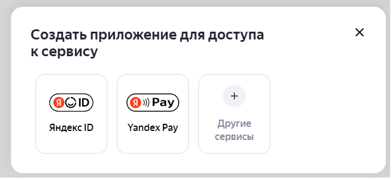
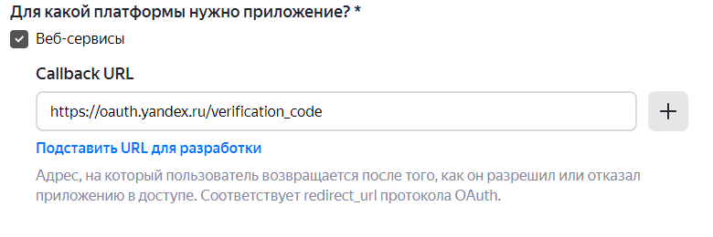
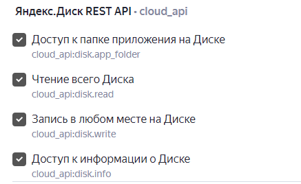
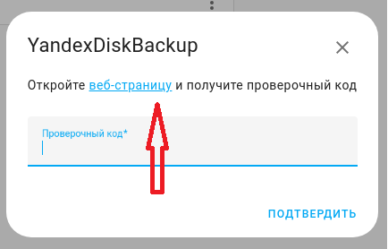
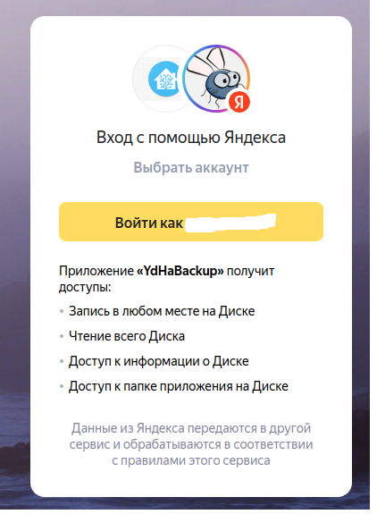
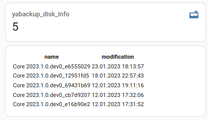

# Копирование резервных копий Home Assistant на ЯндексДиск


[](https://github.com/custom-components/hacs)

Компонент копирования резервных копий из локального каталога HomeAssistant в произвольно выбранный каталог ЯндексДиска.

В своей работе компонент использует библиотеку [yadisk](https://github.com/ivknv/yadisk)

Компонент представляет из себя сенсор, содержащий информацию о содержимом каталога ЯндексДиска и две кнопки, предназначенных для обновления данной информации и для синхронизации локального каталога и каталога на ЯндексДиске.
Количество файлов в каталоге ЯндексДиска настраивается.

Для работы компонента необходимо создать приложение Яндекс в своём Яндекс аккаунте и дать ему права на доступ к ЯндексДиску.


## Установка


**Способ 1.** Вручную скопируйте папку `yabackup` из [latest release](https://github.com/maxifly/YaBackup/releases/latest) в директорию `/config/custom_components`.

## Настройка

### Создание Яндекс приложения

1. Необходимо зайти в свой аккацнт на Яндексе и перейти к [списку ваших приложений](https://oauth.yandex.ru/)
2. Выбрать пункт "Создать приложение"
3. Выбрать вариант "Другие сервисы" 

> 

5. Заполнить "название приложения", желательно загрузить иконку приложения
6. В пункте "для какой платформы?" выбрать "Веб-сервисы" и "подставить URL для разработки"
 
> 

7. В списке приложений выбрать "Яндекс.Диск REST API" и необходимые разрешения 

> 

8. После сохранения изменений будет создано приложение. Необходимо запомнить ClientId и ClientSecret. (Доступ к этому приложению будет всегда возможен на странице [со списком ваших приложений](https://oauth.yandex.ru/))

### Настройки на стороне Home Assistant
1. Перейти на вкладку "Настройка/Устройства и службы"
2. Выбрать "Добавить интеграцию". Выбрать интеграцию YandexDiskBackup
3. Указать путь до каталога на стороне Яндекс Диска (Обязательно укажите "слеш" в начале пути) и максимальное количество файлов в каталоге. Нажать "подтвердить"
4. Заполнить ClientId и ClientSecret. Нажать "подтвердить"
5. Перейти по ссылке

> 


6. Перейдя по ссылке подтвердить разрешение на доступ к Яндекс Диску и получить код подтверждения. Вернуться к настройкам и код в соответствующее поле

> 

## Объекты интеграции

### Сенсор состояния каталога на Яндекс Диске (yabackup_disk_info)
|Атрибут|Назначение|
|---|---|
|state| Количество файлов в каталоге|
| markdown_file_list| Список самых свежих 10-ти файлов в виде markdown таблицы|

Код сенсора в lovelace:

```
- type: vertical-stack
  cards:
  - type: sensor
    entity: sensor.yabackup_disk_info
  - type: markdown
    content: "{{ state_attr('sensor.yabackup_disk_info','markdown_file_list') }}"
```
Результат:

> 

## Кнопка обновления информации о каталоге на Яндекс Диске (yabackup_update_button)

   Можно как нажимать кнопку вручную, так и программировать ее нажатие в автоматизациях. В результате содержимое сенсора yabackup_disk_info должно обновится. Однако это произойдёт не сразу, а после того, как ядро Home Assitant запросит новое состояние (примерно 5 - 10 минут после нажатия)

## Кнопка синхронизации локального каталога с резервными копиями и каталога на Яндекс Диске (yabackup_upload_button)

Можно как нажимать кнопку вручную, так и программировать ее нажатие в автоматизациях. Производятся следующие действия:
 - На Яндекс Диск копируются новые файлы с резервными копиями.
 - Если на Яндекс Диске количество файлов превышает маскимально допустимое (согласно настройкам интеграции), то наиболее старые файлы удаляются.
 - Обновляются данные сенсора yabackup_disk_info

## Особенности сохранения файлов на Яндекс Диске
Замечено, что при использовании Yandex Rest Api при копировании файлов с расширением копирование происходит значительно с меньшей скоростью, чем без использования расширений (к примеру 10 минут против 10 секунд). 
С чем это связано - доподлинно не известно. В связи с этой особенностью компонент переносит файлы на Яндекс Диск без расширения.